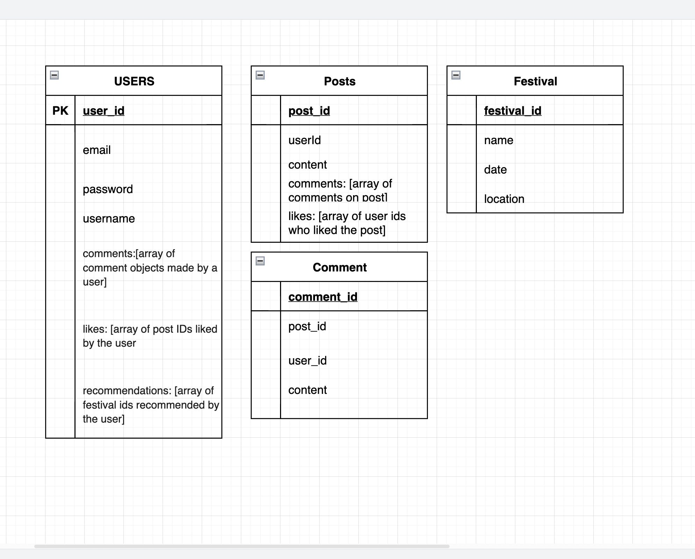

Vibefest
Overview
Vibefest is a unique social media platform designed exclusively for festival goers. With its integration of ChatGPT, the app provides personalized recommendations and suggestions to enhance the festival experience for users. Whether they're seeking information about upcoming festivals, connecting with fellow festival goers, or exploring new music genres, Festival Connect offers a seamless and engaging platform for the festival community.

Technologies Used
_________________
- MongoDB: A NoSQL database for efficient and scalable data storage and retrieval.
- Express.js: A web application framework for building robust and scalable APIs.
- React: A JavaScript library for building user interfaces.
- Node.js: A server-side JavaScript runtime for building fast and scalable network applications.
- ChatGPT API: A language model API that offers AI-powered chat capabilities, enabling personalized recommendations and interactions.
(maybe songkick api or discovery api)
- Tailwind CSS: A utility-first CSS framework for quickly styling your application.

Wireframes

ERD

RESTful Routing Chart
| HTTP Method | Route                          | Description                                           |
|:----------- |:------------------------------ |:----------------------------------------------------- |
| POST        | /users/register                | Create a new user account                             |
| POST        | /users/login                   | Authenticate and log in a user                        |
| GET         | /users/profile                 | Get user profile info                                 |
| PUT         | /users/profile                 | Update user profile information                       |
|             |                                |                                                       |
| GET         | /festivals                     | Get a list of upcoming festivals                      |
| GET         | /festivals/:id                 | Get detailed information about a specific             |
| GET         | /feed                          | Retrieve all posts from users for the feed/home page. |
| POST        | /posts                         | Create a new post                                     |
| GET         | /posts                         | Get all posts                                         |
| GET         | /posts/:id                     | Get a specific post                                   |
| PUT         | /posts/:id                     | Update a specific post                                |
| DELETE      | /posts/:id                     | Delete a specific post                                |
| POST        | /posts/:id/like                | Like a post                                           |
| POST        | /posts/:id/comments            | Create a new comment on a post                        |
| GET         | /posts/:id/comments            | Get all comments on a post                            |
| DELETE      | /posts/:id/comments/:commentId | Delete a specific comment on a post                   |
| PUT         | /posts/:id/comment/:commentId  | Update a comment                                      |
| GET         | /recommendations               | Get personalized festival recommendations             |
|             |                                |                                                       |

MVP Goals
- User Registration and Authentication: Users can create accounts, log in, and manage their profiles. (Est. Time: 1 day)
- Festival Listings: Integrate an API (e.g., Songkick or Ticketmaster) to fetch and display upcoming festivals. (Est. Time: 1 day)
- Personalized Recommendations: Utilize the ChatGPT API to provide users with personalized festival recommendations based on their preferences and interests. (Est. Time: 2 days)
- Social Features: Enable users to post, like, comment on, and share content related to festivals.
- Basic CRUD Functionality: Implement create, read, update, and delete operations for user posts.
- User Interface: Design an intuitive and visually appealing interface for seamless navigation and interaction. (Est. Time: 1 day)

Stretch Goals
- Geolocation: Implement geolocation features to help users discover festivals happening near their current location. 
- Social Sharing: Allow users to share their festival experiences, photos, and recommendations with their social networks and check in to festivals they attended. 
- User-generated Content: Enable users to create and share their own festival events, fostering community engagement and collaboration. 
- Advanced User Profiles: Expand user profiles to include additional information such as favorite artists, attended festivals, and reviews.
- Advanced Search: Implement advanced search filters to help users find festivals based on specific criteria such as genre, location, or date. 
- Push Notifications: Send push notifications to users for important updates, new festival announcements, or chat message notifications. 
- Chat Functionality: Enable users to connect and communicate with each other real-time through private messages or group chats. 
- Advanced Recommendation System: Enhance the festival recommendation feature by incorporating user feedback and preferences.

User Stories and User Flow
MVP User Stories:

- As a new user, I want to create an account with my email and password so that I can access the Vibefest platform.
- As a registered user, I want to log in to my account to securely access my profile and personalized recommendations.
- As a logged-in user, I want to view a list of upcoming festivals, including their dates and locations, so that I can explore the festival options.
- As a festival enthusiast, I want to see detailed information about a specific festival, including the lineup and venue details.
- As a user, I want to post my thoughts and experiences about a festival, so that I can share them with other users.
- As a user, I want to be able to like and comment on posts made by other users, to engage in discussions and show my appreciation.
- As a user, I want to have the ability to edit or delete my own posts if I need to make any changes.
- As a user, I want to have a visually appealing and user-friendly interface for easy navigation and interaction.
- As a user, I want to receive personalized festival recommendations based on my preferences and interests to discover new festivals.
- As a user, I want to be able to update my profile information, such as my display name and profile picture, to personalize my experience on Vibefest.

Stretch Goal User Stories:

- As a user, I want to be able to see festivals happening near my current location, so that I can find local events easily.
- As a user, I want to be able to share my festival experiences, photos, and recommendations with my social networks, to engage with my friends.
- As a user, I want to have the ability to create and share my own festival events, to contribute to the festival community.
- As a user, I want to have an advanced search functionality to find festivals based on specific criteria, such as genre, location, or date.
- As a user, I want to receive push notifications for important updates, new festival announcements, or messages from other users.
- As a user, I want to have the ability to connect and communicate with other festival-goers through private messages or group chats.
- As a user, I want the festival recommendation system to improve over time based on my feedback and preferences.

Schedule
Day 1: Learning and Set Up
    - Set up development environment (install necessary tools and dependencies).
    - Create a new MERN project for app.
    - Git familiarized with the project structure and essential concepts.

Day 2: User Authentication and Profile
    - Implement user registration and login functionality.
    - Create user profiles with basic information (name, profile picture).
    - Allow users to edit and update their profile information.

Day 3: Festival Listings and Recommendations
    - Integrate an API (such as Songkick or Ticketmaster) to fetch festival event data.
    - Display a list of upcoming festivals with relevant details (date, location, lineup).
    -Implement a recommendation system using the ChatGPT API to suggest festivals based on user preferences (music genre, location, past interests).

Day 4: Social Features and Tailwind CSS

    - Implement a feed or timeline where users can post and share content related to festivals.
    - Enable users to like, comment on, and share posts from other users.
    - Implement basic CRUD (Create, Read, Update, Delete) functionality for posts.
    - Learn Tailwind CSS (tutorials, documentation, online resources) to understand its principles and usage.

Day 5: User Interactions and Tailwind CSS Integration

    - Allow users to follow or connect with other festival-goers.
    - Implement a messaging system or chat feature for direct communication between users.
    - Enable users to discover and join groups or communities centered around specific festivals or interests.
    - Incorporate Tailwind CSS into your project, applying its utility classes to enhance the visuals and responsiveness.

Day 6: Cleaning and Testing  
    -Refine the user interface and improve the app's visual appeal.
    -Perform thorough testing and bug fixing.
    -Prepare and finalize MVP.

Potential Roadblocks
- Allowing posts to have likes and comments may be a potential roadblock.
- API Integration: Integrating external APIs, such as the ChatGPT API and festival event data API, might be difficult to implement and need sufficient time for testing and debugging, also time for undertsnading API documentation.
- Data Modeling: Designing the data model using MongoDB might require careful consideration. Defining the relationships between entities, ensuring data consistency can be complex and time-consuming. Also, creating the correct relationships between models.
- User Experience Design: Ensuring smooth navigation, responsiveness, and a cohesive design can require additional attention and iteration, must take into account everytime something new is added.
